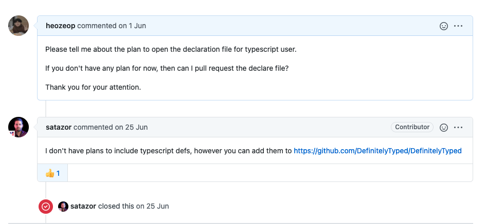
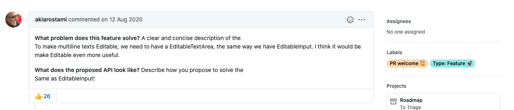
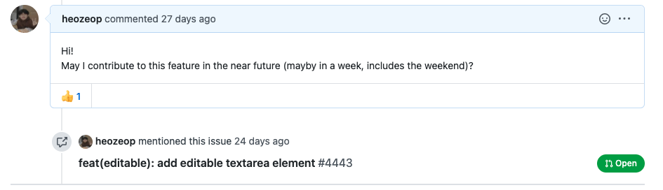

# TL;DR

1. 업무상 필요에 의해 컨트리 뷰션했습니다.
1. 외부 js라이브러리를 typescript에서 쓰기 위해 래핑하였습니다.
1. chakra ui를 사용하며, 필요를 느낀 컴포넌트를 만들었습니다.
1. 재미있었고, 공부가 많이 되었습니다.

# 어쩌다...

다음 두가지 상황에서 각각 definitly typed 프로젝트와 chakra ui 프로젝트에 PR을 올리게 되었습니다.

1. 도입한 라이브러리에서 typescript 지원을 하지 않는다.
1. 내가 필요한 기능이 닫힌 이슈로만 올라와 있다.

### 도입한 라이브러리에서 typescript 지원을 안한다.

scroll restoration과 관련하여, 모바일에서 계속 오류가 나는 상황이 있었습니다. 이 버그는 사용환경인 모바일에서 신경이 안쓰이진 않을 정도로 '가끔' 일어났기 때문에 수정이 어려웠습니다.

그렇게 시간이 조금 흐르고, CTO께서 라이브러리 하나를 소개시켜 주셨습니다. 해당 라이브러리는 (@moxy/next-router-scroll)[https://www.npmjs.com/package/@moxy/next-router-scroll]이라는 라이브러리로, 굉장히 가볍고, 코드 또한 간단한 라이브러리였습니다.

저는 위 라이브러리를 사용해 구현 후, 실험을 반복하여 제대로 작동하는 것을 확인하였습니다. 다만, 이 라이브러리에는 타입 정의 파일이 없어 직접 등록하거나 만들어 주기를 기다려야 했습니다. 꽤나 시간이 지체된 오류라서, 일단 적용 후 패치하기로 합의하였습니다. 그래서 일단 해당 라이브러리 레포에 issue를 등록하였습니다.

위 사진에 나온 것처럼, 직접 등록해도 괜찮다는 답변을 받았습니다. 그래서 처음으로 '라이브러리의 type file'을 [DefinitelyTyped](https://github.com/DefinitelyTyped/DefinitelyTyped)에 PR하게 되었습니다.

### 내가 필요한 기능이 닫힌 이슈로만 올라와 있다.

저는 사내 컨텐츠 관리자용 관리자 페이지를 개발하게 되었습니다. 각 엘리먼트의 대략적인 틀은 CTO 분께서 잡아주시고, 제가 확장하는 방식으로 개발하였습니다. 그 과정에서 프로젝트에 새로 도입한 '[Chakra UI](https://chakra-ui.com/)' 라이브러리의 'editable'이라고 하는 컴포넌트를 사용하게 되었습니다. 해당 컴포넌트는 'span' 엘리먼트에 focus event 발생 시, input을 통해 텍스트 데이터를 입력 가능하게 해준 컴포넌트 입니다. 따라서 수정하는 입장에서 inline 수정을 하는 것 같은 느낌을 받게 됩니다.

이 컴포넌트의 단점은 **여러 줄의 입력이 불가**하다는 점입니다. 그래서 일단 프로젝트에서 사용할 custom component를 만들어 사용하고, 혹시나 하여 레포의 이슈를 뒤져보았습니다. 그 결과 아래와 같은 이슈를 찾았고, 분명 프로젝트의 로드맵에 포함되어 있는 것을 확인하였습니다.

저는 반가운 마음에 comment를 달았습니다.

comment후 별다른 반응이 없자, 일단 올려보잔 생각에 작업을 시작했습니다.

# 각 레포에 대한 작업 과정 및 느낀점

## DefinitelyTyped

위 레포에 PR을 등록하는 과정은 작업 시작부터 꽤 오랜 시간이 흐른 뒤였습니다. 약 1달 조금 넘는 시간동안 아래 순서대로 작업을 진행하였습니다.

### 작업 과정

1. moxy 라이브러리 클론해서 tsconfig 등록 후 `tsc -d`를 통해 타입 파일 생성
1. DefinitelyTyped를 클론 후 환경 설정
1. 회사 프로젝트로 테스트 하면서 moxy library의 .d.ts 파일 재구성
1. DefinitelyTyped 프로젝트에서 .d.ts의 테스트 하면서 정의 파일 수정/PR
1. dependancy가 걸린 moxy라이브러리를 [microsoft/DefinitelyTyped-tools](https://github.com/microsoft/DefinitelyTyped-tools)에 추가.
1. 타입 배포

### 느낀점

#### 1. type 잘짜는 분들 멋지다.

   이번에 다른 프로젝트의 @types/\*를 많이 참고하였습니다. 대부분의 경우, 해당 파일만 읽어도 어떻게 활용할지 눈에 보이는 것이 굉장히 멋졌습니다.

#### 2. 나도 할 수 있다.

   저는 '오픈 소스'라고 하는 것에 막연한 우상심을 가지고 있었습니다. 이번에 작은 작업이지만 기여하는 과정에 참여해 보며, '나도 할 수 있다'라는 자신감을 얻게 된 것 같습니다.

#### 3. 고민 된다.

   JS프로젝트는 필연적으로 사용에 자유로운 부분이 많습니다. 이번에 하나하나 타입을 붙여 나가며, '아... 이건 이렇게도 쓰는 사람이 있을 것 같은데' 하는 고민을 참 많이 하였습니다. 제 손으로 타입을 정의하며 'Use Case'를 한정하는 것 같아 조금 불안하기도 했습니다. 그 순간 순간, 라이브러리를 만들고 관리하시는 분들이 더욱 멋져보였습니다.

## Chakra-ui

분명 로드맵에 있는 작업이었지만, 제가 comment를 남긴 다음날 해당 issue가 tridge로 가버려, 현재는 확인하기 어렵게 되었습니다. 그래서인지 아직 진행중인 feature 입니다.

### 작업 과정

1. issue 확인 후 spec 정리
1. chakra ui 클론 후 환경 설정
1. editable textarea 추가 작업
1. docs 수정
1. PR 후 대기중

### 느낀점
#### 1. 코드 리뷰는 짜릿하다.

이번에 처음으로 전혀 모르는 이에게 코드리뷰를 받아보았습니다. 물론 코어 멘버의 리뷰는 아니지만, 제가 안일하게 처리한 부분에서 굉장히 친절하게 수정을 요청해 주었습니다. 누군가 제 코드를 보고 같이 고민한다는게 참 좋았습니다.

#### 2. monorepo 구조는 신기하다.

chakra ui는 모든 컴포넌트 package들이 개별 배포 주기를 가지는 monorepo 형식입니다. 이에 따라 레포지토리 관리를 [lerna](https://github.com/lerna/lerna)를 이용하고, 수정 사항들을 쉽게 보기 위해 test 외에도 [changeset](https://github.com/atlassian/changesets)을 사용합니다. 

#### 3. 최소한의 commit convention은 좋다.

위 프로젝트에서는 [conventionalcommits](https://www.conventionalcommits.org/en/v1.0.0/) 라는 간단한 commit convention을 따릅니다. 저는 commit convention이라는 것의 실효성에 의문을 가지고 있었습니다. 하지만 이번에 커밋 history를 읽어보며, 커밋 기록을 통해 과거의 개발 맥락을 파악하는 경험을 해보니 commit convention이 '개발자 간 배려'를 의미할 수 있겠다는 생각이 들었습니다. 그래서 위 convention을 조금씩 따라해 보고 있습니다.

#### 4. 테스트는 자리를 잡게 된다면, 필요하다.

 저는 지금껏, Test를 작성하는 '프로젝트'를 개인 이외에서 해본적이 없습니다. 모두 당장 개발이 필요했기에, 오히려 테스트를 개발하는 것이 속도를 늦추진 않을까 걱정이 되었습니다. 하지만 chakra ui의 테스트 관리를 보면서, 어느정도 자리잡은 기능들에 대해서는 테스트를 붙이는 것이 좋겠다는 생각을 하게 되었습니다. 테스트를 짜는 것이 실제 프로덕트 개발에 방해되지 않는 수준으로 가능한 것을 목표로 연습해야겠다는 생각을 하였습니다.

# 결론
막연하게 두려웠던 오픈 소스가 조금 친근해진 경험이었습니다. 앞으로도 기여하면서 제 코드가 다른 분들에게도 좋은 영향을 줄 수 있으면 좋겠습니다.